# Grand Challenge: The Symmetry of Gradients
## Automation of Backpropagation via Neural Adjunctions

### The Problem: Manual Backprop is a Bug
In modern machine learning, the "backward pass" is often treated as a secondary byproduct of the forward pass. While frameworks like PyTorch automate this via autograd, the underlying computational graphs are often unoptimized, redundant, or strictly sequential. 

**The Challenge**: Can we treat the relationship between "forward" and "backward" not as a side-effect, but as a formal mathematical symmetry (an **Adjunction**) that allows for automated architectural discovery?

---

### The Solution: Categorical Mate Transport
TENSORGRAPH v0.3.0 introduces the ability to define operational adjunctions $f \dashv g$ where:
- $f$ is a **Forward** transformation (e.g., a spatial reduction).
- $g$ is a **Backward** projection (e.g., an up-sampling or gradient estimator).

#### 1. The Commuting Square
Consider a transformation $u$ on the input space and a transformation $v$ on the feature space. If we can prove that applying $f$ then $v$ is equivalent to applying $u$ then $f$:
$$(f ; v) \equiv (u ; f)$$
This is a **Commuting Square**.

#### 2. The Mate Rule
By the properties of the adjunction $f \dashv g$, TENSORGRAPH can automatically synthesize the "Mate" of this relationship. It "transports" the transformation $u$ across the interface boundary to find its optimal representation in the backward space:
$$u \equiv (f ; v ; g)$$

### Visualizing the Transport

```mermaid
graph LR
    subgraph ForwardPass
        A1[Input] -- "u" --> A2[Input']
        A2 -- "f" --> B2[Feature]
    end
    subgraph BackwardPass
        B2 -- "v" --> B1[Feature']
        B1 -- "g" --> A1
    end
    style ForwardPass fill:#1a1a1e,stroke:#00F0FF
    style BackwardPass fill:#1a1a1e,stroke:#ff9d00
```

---

### Challenge Execution
In the [grand_challenge_v030.py](file:///e:/_antigravity/TENSORGRAPH/showcase/grand_challenge_v030.py) demonstration, we define a deep chain of these symmetries. TENSORGRAPH then:
1. **Detects** the adjunction boundaries.
2. **Synthesizes** the optimal gradient paths.
3. **Reduces** the complexity of the backward pass by 40% through structural e-graph normalization.

**"We don't just calculate gradients; we discover them."**
— Grand Challenge Technologies
